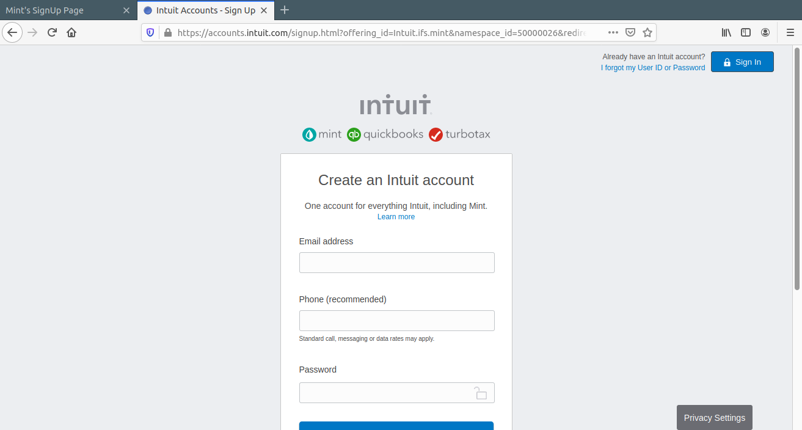

# DISPLAYING AND INPUTTING DATA

> This project consists of building an HTML document that matches the appearance of [mint.com’s](https://accounts.intuit.com/signup.html?offering_id=Intuit.ifs.mint&namespace_id=50000026&redirect_url=https%3A%2F%2Fmint.intuit.com%2Foverview.event%3Ftask%3DS) signup page

## Built With

- HTML,
- CSS

## Getting Started

To test the code please clone the repository [here](https://github.com/haraphat01/mint-clone)

Run the index file with Google Chrome Browser

### Prerequisites

HTML5 and CSS3 compatible browser

### Deployment

You can use [raw githack](https://raw.githack.com/) to view this page directly from github.

You can view the site itself [here](https://rawcdn.githack.com/haraphat01/mark_arafat_youtube/491817b9fbfbca10ba7039c20c6212c2d18bcfa6/index.html) .Have fun!

## Authors

👤 **Mark James Kiptubei**

- Github: [@kiptubei](https://github.com/kiptubei)

👤 **Arafat Akata**

- Github: [@haraphat01](https://github.com/haraphat01)

## 🤝 Contributing

Contributions, issues and feature requests are welcome!

Feel free to check the [issues page](issues/).

## Show your support

Give a ⭐️ if you like this project!

## Acknowledgments

- Microverse

## 📝 License

This project is [MIT](lic.url) licensed.
